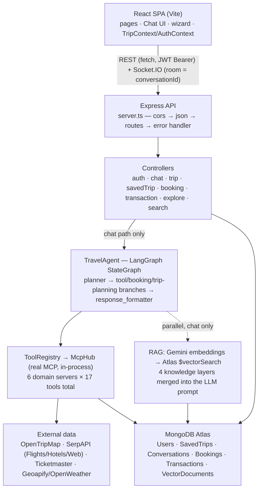
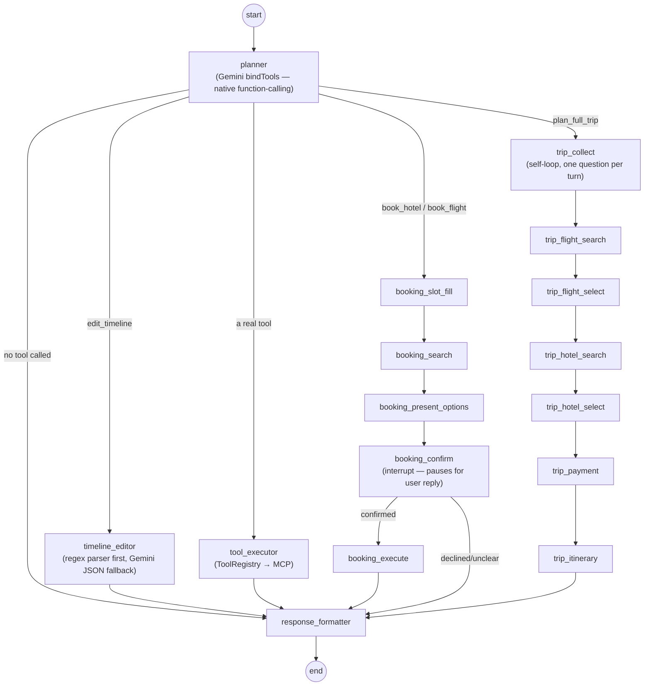
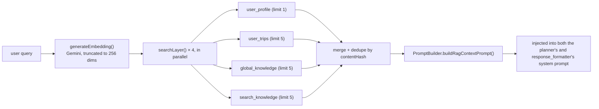

# 🍵 TravelTea

TravelTea is a full-stack **AI travel planning app**. You can plan a trip two ways: a traditional step-by-step wizard (destinations → preferences → budget → generated itinerary), or a **conversational AI agent** that searches real places/flights/hotels/events, builds and edits a day-by-day itinerary, and walks you through a full (simulated) booking and payment — all backed by the same underlying data, so nothing you do in chat is a second, disconnected system from the manual planner.

This README describes the app **as it actually exists in the code today** — not a wishlist. Where something is legacy, unfinished, or simulated, it's called out explicitly rather than glossed over.

---

## Contents

- [What it does](#what-it-does)
- [Architecture at a glance](#architecture-at-a-glance)
- [The AI agent — LangGraph, MCP, RAG](#the-ai-agent--langgraph-mcp-rag)
- [Tech stack](#tech-stack)
- [Project structure](#project-structure)
- [Getting started](#getting-started)
- [API reference](#api-reference)
- [QA scripts](#qa-scripts-there-is-no-real-automated-test-suite-yet)
- [Known limitations & honest engineering notes](#known-limitations--honest-engineering-notes)
- [License](#license)

---

## What it does

**Problem it solves:** planning a trip means juggling attractions, restaurants, flights, hotels, events, weather and budget across a dozen disconnected sources. TravelTea puts one conversational agent in front of all of it, backed by real external data, kept in sync with the same itinerary you can also edit by hand.

**Feature list (all implemented, none aspirational):**

- 🔐 JWT auth (signup/login, bcrypt-hashed passwords)
- 💬 Real-time AI chat assistant (Socket.IO + REST), powered by a real LangGraph agent
- 🧭 Step-by-step trip-planning wizard, sharing the same trip data model as chat
- ✏️ Conversational timeline editing ("move the museum to day 2", "swap day 1 and 2") — deterministic parsing first, LLM fallback second
- 🗺️ Places/attractions, restaurants, flights, hotels, events, and general web search — all via tool calls
- 📍 Interactive maps (Leaflet) for the itinerary
- 🔍 Saved trips with hybrid (lexical + semantic) search, and semantic personalization via RAG
- 🧾 Simulated booking + payment flow (card / UPI / netbanking), with a real "declined card" test case, concurrency-safe payment claims, and PCI-conscious masked-only storage — no real payment gateway, ever
- 📊 Transaction history

---

## Architecture at a glance



This is not "React talks to an LLM." It's React → REST/Socket → Express → a **LangGraph agent** → a real **MCP tool layer** → external APIs, with a parallel **RAG retrieval pipeline** feeding both tool selection and the final answer.

---

## The AI agent — LangGraph, MCP, RAG

### LangGraph: one state machine, four branches

`backend/src/agents/travel-agent.ts` builds a single LangGraph `StateGraph` with **16 nodes**, compiled with a `MemorySaver` checkpointer (in-process — see [limitations](#known-limitations--honest-engineering-notes)):



- **Tool selection is native Gemini function-calling** (`model.bindTools(...)`), not prompt+regex JSON. If the LLM call itself fails (quota/network), the planner falls back to a pure keyword classifier (`intent-detector.ts`'s `fallbackDetection()`) and converts its result into the same `toolCalls` shape, so the rest of the graph doesn't need to know which path ran.
- **Cross-turn pause/resume** (booking confirmation, the multi-step trip-planning flow) uses LangGraph's `interrupt()` + `Command({ resume })`, keyed by `thread_id = conversationId`. This is the trickiest part of the codebase — every node that can be resumed is deliberately split so no side effect (booking creation, payment) sits *before* that node's last `interrupt()` call, because a resumed node replays from the top.

### MCP: real protocol, not just a naming convention

The backend depends on `@modelcontextprotocol/sdk` (`^1.29.0`) and uses its real `Client`, `McpServer`, and `InMemoryTransport` classes. Every tool call is a genuine `tools/call` JSON-RPC message — there's just no subprocess or network hop, since the transport is `InMemoryTransport.createLinkedPair()` (all 6 domain servers run in the same Node process).

| Domain server | Backed by | Tools |
|---|---|---|
| `places` | OpenTripMap API | search destinations, place details, nearby attractions, restaurants, search by category |
| `transport` | Geoapify Routing API (Haversine fallback) | calculate distance, get directions, estimate route |
| `websearch` | SerpAPI (`google` engine) + Gemini summarization | web search, travel tips |
| `events` | Ticketmaster API | search events |
| `flights` | SerpAPI `google_flights` engine | search flights |
| `hotels` | SerpAPI `google_hotels` engine | search hotels |

That's **13 MCP tools**, plus **4 local "account" tools** (`agents/tools/account.ts` — list saved trips, get upcoming trip, get/update preferences) that deliberately never cross the MCP boundary, because they need a server-trusted `userId` that must never be exposed in a schema the LLM can see or fill in.

A `presentation.ts` file per domain renders the tool's raw JSON result to chat-ready markdown, appended as a second block in MCP's `content[]` array — this is an explicit **TravelTea convention layered on top of MCP, not part of the protocol itself**.

**No Amadeus.** Flights/hotels deliberately use SerpAPI's Google Flights/Hotels engines ("legitimate scraping-as-a-service") instead of a paid Amadeus API. `services/amadeusService.ts` still exists and is still called from one place — `travelDataController.getTimelineData`'s hotel-timeline aggregation — flagged in `progress.md` as a known leftover being replaced, not something that was missed. The actual booking/search flows never touch it.

### RAG: 4-layer parallel vector search



- **Embeddings:** Gemini (`gemini-embedding-2`), truncated from its native output to **256 dimensions** — a deliberate tradeoff to fit MongoDB Atlas's free (M0) tier storage budget (`services/embedding.ts`).
- **Index:** Atlas Vector Search index `vector_index` on `VectorDocument.embedding`, **cosine similarity**, codified (not just Atlas-UI-configured) in `backend/src/scripts/fix-vector-index.ts`:
  ```ts
  {
    fields: [
      { type: 'vector', path: 'embedding', numDimensions: 256, similarity: 'cosine' },
      { type: 'filter', path: 'category' }, { type: 'filter', path: 'country' },
      { type: 'filter', path: 'city' },     { type: 'filter', path: 'tags' },
      { type: 'filter', path: 'sourceType' }, { type: 'filter', path: 'userId' },
      { type: 'filter', path: 'archived' },   { type: 'filter', path: 'expiresAt' },
    ],
  }
  ```
  Every field used in a `$vectorSearch` `filter:` clause **must** be declared here — Atlas silently returns zero results (not an error) otherwise. This exact gap (missing `archived`/`expiresAt` filter paths) broke RAG end-to-end early in development; see `progress.md`.
- **Not a hybrid/reranked pipeline today.** `backend/dist/` (stale compiled output) contains `hybrid-retrieval.service.ts`, `text-search.service.ts` and `reranker.service.ts` from an earlier iteration — **these files do not exist in `backend/src/vector/services/` anymore.** The live implementation is 4 parallel `$vectorSearch` queries merged/deduped, not vector+keyword fusion with reranking. Don't be misled by `dist/`.
- Saved-trip search (`services/tripSearch.ts`, `GET /api/saved-trips/search`) is a **separate** hybrid: real lexical regex search + `$vectorSearch`, merged with lexical results ranked first and a relative-score cutoff for the semantic half.

---

## Tech stack

### Backend (`backend/`) — Node.js, TypeScript (ESM), run via `tsx`

| Package | Version | Purpose |
|---|---|---|
| `express` | ^4.19.0 | HTTP server |
| `mongoose` / `mongodb` | ^8.7.0 / ^7.4.0 | ODM / driver — also hosts Atlas Vector Search |
| `socket.io` | ^4.8.0 | Real-time chat push (rooms = conversationId) |
| `@langchain/langgraph` | ^1.4.7 | Agent state machine — pause/resume across chat turns |
| `@langchain/google-genai` | ^2.2.0 | Gemini chat model + embeddings |
| `@langchain/core` | ^1.2.2 | LangChain primitives |
| `@modelcontextprotocol/sdk` | ^1.29.0 | Real MCP client/server (`Client`, `McpServer`, `InMemoryTransport`) |
| `zod` | ^3.23.0 | Tool argument schemas, structured LLM output |
| `jsonwebtoken` | ^9.0.3 | Stateless JWT auth |
| `bcrypt` | ^6.0.0 | Password hashing (the live code path — `bcryptjs` is also a dependency but unused by current auth code) |
| `serpapi` | ^2.2.1 | Flights/hotels/web search (Google engines) |
| `ioredis` | ^5.4.0 | Redis client (see [limitations](#known-limitations--honest-engineering-notes) — mostly unused currently) |
| `csv-parse` | ^5.6.0 | RAG ingestion parsers |
| `axios`, `uuid` | ^1.7.0 / ^14.0.1 | HTTP client, ID generation |

Dev: `typescript` ^5.6.0, `tsx` (dev runner + all one-off scripts), `eslint` 9 (flat config), `vitest` ^2.0.0 (declared, but see [QA scripts](#qa-scripts-there-is-no-real-automated-test-suite-yet)).

### Frontend (`frontend/`) — React 19 + Vite

| Package | Version | Purpose |
|---|---|---|
| `react` / `react-dom` | ^19.1.1 | UI library |
| `react-router-dom` | ^7.9.3 | Client-side routing, `ProtectedRoute`/`PublicRoute` gates |
| `vite` | ^7.1.7 | Dev server / build |
| `tailwindcss` | ^4.3.2 | Utility CSS |
| `shadcn` / `radix-ui` / `@radix-ui/react-slot` | ^4.13.0 / ^1.6.1 | Accessible unstyled component primitives |
| `socket.io-client` | ^4.8.3 | Real-time chat client |
| `leaflet` / `react-leaflet` | ^1.9.4 / ^5.0.0 | Maps |
| `framer-motion` | ^12.42.2 | Animation |
| `react-markdown` | ^10.1.0 | Renders AI chat responses |
| `date-fns` | ^4.1.0 | Date utilities |
| `axios` | ^1.18.1 | HTTP client |

---

## Project structure

```text
traveltea/
├── README.md
├── PROJECT_STRUCTURE.md          # older, more granular structure snapshot (some detail now stale — this README is the current source of truth)
├── progress.md                   # append-only log of completed build phases (great source for "why" a design choice was made)
├── traveltea-interview-guide.html
│
├── backend/                      # Express + TypeScript API server
│   ├── src/
│   │   ├── server.ts             # Express + Socket.IO bootstrap, route mounting, mcpHub.init()
│   │   │
│   │   ├── agents/                       # the LangGraph travel agent
│   │   │   ├── README.md                 # hand-maintained deep-dive on the agent architecture
│   │   │   ├── travel-agent.ts           # the StateGraph — planner, tool_executor, timeline_editor, response_formatter
│   │   │   ├── booking-pipeline.ts       # booking_slot_fill → search → present → confirm (interrupt) → execute
│   │   │   ├── trip-planning-pipeline.ts # trip_collect → flight/hotel search+select → payment → itinerary
│   │   │   ├── tool-registry.ts          # aggregates 13 MCP tools + 4 local "account" tools
│   │   │   ├── intent-detector.ts        # Zod-schema intent classifier; only its keyword fallbackDetection() is live
│   │   │   ├── prompts.ts                # system / tool-selection prompts
│   │   │   └── tools/                    # account.ts, account-presentation.ts — existing features exposed as tools
│   │   │
│   │   ├── mcp/                          # the real MCP client/server plumbing
│   │   │   ├── hub.ts                    # boots 6 domain servers over InMemoryTransport, McpHub.callTool()
│   │   │   ├── createDomainServer.ts     # wraps a tool array into a real McpServer + presentation layer
│   │   │   └── verify*.ts                # boot-time schema/behavior checks (npm run mcp:verify*)
│   │   │
│   │   ├── mcp-servers/                  # the 6 domain servers: places, transport, websearch, events, flights, hotels
│   │   │   └── <domain>/{api.ts, tools.ts, presentation.ts, ...}
│   │   │
│   │   ├── vector/                       # RAG / knowledge-base layer
│   │   │   ├── models/VectorDocument.ts  # embedding field + 9 Mongo indexes
│   │   │   ├── services/                 # vector-retrieval, vector-embedding, search-knowledge, trip-knowledge, user-profile
│   │   │   ├── repositories/vector.repository.ts
│   │   │   ├── ingestion/                # csv/json/markdown parsers + pipeline
│   │   │   ├── seed-data/                # goa.json, jaipur.json, manali.json
│   │   │   └── scripts/seed-knowledge.ts
│   │   │
│   │   ├── controllers/ + routes/        # REST layer — auth, chat, trip, savedTrip, booking, transaction,
│   │   │                                 # travelData, travelSearch, explore, search, itinerary
│   │   ├── models/                       # User.js, Trip.js (legacy simple), SavedTrip.js (primary),
│   │   │                                 # Conversation.ts, Booking.ts, Transaction.ts
│   │   ├── services/                     # bookingService, timelineMutationEngine, tripSearch, tripPersistence,
│   │   │                                 # itineraryBuilder, embedding, geocoding, weatherService,
│   │   │                                 # ticketmasterService, googlePlacesAPI, amadeusService (legacy, see above)
│   │   ├── middleware/auth.js            # Bearer JWT verify → req.userId
│   │   ├── utils/                        # cache.ts (TTL + in-flight dedup), deterministicParser.ts,
│   │   │                                 # idGenerator.ts (booking refs / transaction ids), logger.ts
│   │   ├── config/                       # database.ts, llm.ts (Gemini client factory), configenv.js
│   │   └── scripts/                      # qa-*.ts (see QA section), fix-vector-index.ts, fix-trip-search-index.ts
│   └── package.json
│
└── frontend/                      # React (Vite) single-page app
    └── src/
        ├── App.jsx                # routes, ProtectedRoute/PublicRoute gates
        ├── contexts/               # AuthContext.jsx, TripContext.jsx
        ├── hooks/useSocket.js      # owns the Socket.IO client, event listeners, room join/leave
        ├── lib/api.js              # API client wrapper
        ├── pages/                  # Chat, TripPlannerPage + wizard steps, SavedTrips, UpcomingTrips,
        │                           # Flights, Hotels, Transactions, Explore, Profile, Login/Signup, ...
        ├── components/
        │   ├── Chat/               # MessageBubble, MessageInput, BookingOptionsCard, BookingReceipt, TripStepCard
        │   ├── booking/            # BookingCheckout.jsx, PaymentMethodForm.jsx
        │   ├── Timeline/           # TimelineTab, TimelineDay, TimelineSections
        │   └── ui/                 # shadcn/radix primitives
        └── services/TravelDataService.js
```

---

## Getting started

### Prerequisites

- Node.js 18+
- MongoDB (a cluster on **MongoDB Atlas** is required for Vector Search — a local MongoDB works for everything except RAG/semantic search)
- API keys: Gemini (required), OpenTripMap, Google Places, OpenWeather, Geoapify, SerpAPI, Ticketmaster (all optional but recommended — features degrade gracefully without them, they just return empty/fallback results)

### Backend

```bash
cd backend
npm install
```

Create `backend/.env`:

```env
PORT=5000
NODE_ENV=development
FRONTEND_URL=http://localhost:5173

MONGODB_URI=mongodb+srv://.../traveltea
REDIS_URL=redis://localhost:6379

JWT_SECRET=your_super_secret_jwt_key
JWT_EXPIRES_IN=7d

GEMINI_API_KEY=your_gemini_api_key
GEMINI_MODEL=gemini-3.1-flash-lite

OPENTRIPMAP_API_KEY=
GOOGLE_PLACES_API_KEY=
OPENWEATHER_API_KEY=
GEOAPIFY_API_KEY=
SERPAPI_API_KEY=
```

```bash
npm run dev              # tsx watch src/server.ts
npm run vector:seed      # optional — seeds the RAG knowledge base (goa/jaipur/manali)
npm run fix:vector       # (re)creates the Atlas vector_index if semantic search returns nothing
npm run mcp:verify       # sanity-checks all 6 MCP domain servers boot correctly
```

### Frontend

```bash
cd frontend
npm install
```

Create `frontend/.env`:

```env
VITE_API_URL=http://localhost:5000/api
VITE_SOCKET_URL=http://localhost:5000
```

```bash
npm run dev
```

Visit `http://localhost:5173`.

---

## API reference

All protected routes expect `Authorization: Bearer <jwt>`.

| Method | Path | Auth | Notes |
|---|---|---|---|
| POST | `/api/auth/register` \| `/login` | public | returns `{ user, token }` |
| GET/PUT/DELETE | `/api/auth/me` \| `/preferences` \| `/profile` \| `/account` | protected | `DELETE /account` cascades saved trips |
| POST/GET/DELETE | `/api/chat` \| `/api/chat/:id` | protected | the whole agent round trip; also pushes `agent:thinking`/`agent:response` over Socket.IO |
| POST/GET | `/api/trips` | protected | legacy, simpler trip model |
| GET/POST/PUT/DELETE | `/api/saved-trips`, `/search`, `/from-itinerary`, `/:id`, `/:id/upcoming` | protected | the primary trip entity; `/search` is hybrid lexical+semantic |
| GET | `/api/search/suggestions` | protected | Gemini-reranked merge of saved trips + OpenTripMap destinations |
| GET | `/api/explore/destinations` \| `/trending` | public | `/trending` cached 1h, aggregated from SavedTrips |
| GET | `/api/explore/recommendations` | protected | LLM-generated, based on the user's trip history |
| GET | `/api/travel-data/timeline` \| `/restaurants` | protected | weather + events + hotels aggregation for the itinerary timeline |
| POST/GET | `/api/bookings`, `/:id`, `/:id/pay`, `/:id/cancel` | protected | simulated booking + payment |
| GET | `/api/transactions` | protected | separate router from `/bookings` on purpose (route-param collision) |
| GET | `/api/travel-search/flights` \| `/hotels` \| `/airports` | protected | direct REST search, shares caching with the chat-tool path |
| POST | `/api/itinerary/generate` \| `/refine` | protected | structured, non-chat itinerary generation (bypasses the LangGraph graph entirely) |

**Socket.IO events**

| Event | Direction | Purpose |
|---|---|---|
| `join:conversation` / `leave:conversation` | client → server | joins/leaves the room named by `conversationId` |
| `agent:thinking` / `agent:response` / `agent:error` | server → room | chat progress + result, scoped to one conversation |
| `itinerary_updated` | server → **everyone** (not room-scoped) | a timeline mutation was applied; frontend re-scopes itself by checking the trip id |

---

## QA scripts (there is no real automated test suite yet)

`vitest` is a declared dependency but there are currently no `*.test.ts` files. Verification instead happens through hand-written scripts in `backend/src/scripts/`, run via `tsx`:

```bash
npm run qa:api        # 34 checks across the REST surface
npm run qa:agent       # 25 checks — LangGraph routing/tool-calling
npm run qa:booking     # 26 checks — booking + payment flow
npm run qa:trip        # 51 checks — trip planning pipeline
npm run qa:search      # 20 checks — hybrid saved-trip search
npm run qa:vector      # RAG/vector search sanity
npm run qa:parser      # deterministic timeline-edit parser
npm run mcp:verify           # all 6 MCP servers boot + list tools correctly
npm run mcp:verify-exec      # tools/call round-trips work
npm run mcp:verify-present   # presentation layer renders without throwing
```

Converting these into a real CI-run test suite (Vitest/Jest) is a known next step, not a claim already made.

---

## Known limitations & honest engineering notes

- **No real payments.** Booking is fully simulated: format-only card/UPI/netbanking validation (no gateway, no Luhn check), one hardcoded card (`4000000000000002`) that always declines for testing the failure path, and only a **masked** payment snapshot (brand/last4, UPI handle, bank name — never a PAN or CVV) is ever persisted.
- **`MemorySaver` checkpointer is in-process only.** A server restart drops every mid-booking or mid-trip-planning conversation that was paused on `interrupt()`. Moving to a persistent (Mongo/Redis-backed) checkpointer is the natural fix.
- **`amadeusService.ts` is legacy but not fully removed** — see the MCP section above. Only `travelDataController.getTimelineData` still calls it.
- **`backend/dist/` is stale compiled output** from an earlier version of the vector/RAG layer (it still contains a hybrid-retrieval + reranker service that no longer exists in `src/`). Always treat `src/` as the source of truth; `dist/` is gitignored build output and not hand-maintained.
- **`.js`/`.ts` split in the backend is a legacy-vs-current boundary, not accidental.** `authcontroller.js`, `auth.js` middleware, `User.js`, `Trip.js`, `SavedTrip.js`, and their routes predate the TypeScript agent/vector/booking work — everything under `agents/`, `mcp/`, `mcp-servers/`, `vector/`, and the `Booking`/`Transaction` models is TypeScript.
- **`ioredis` is a dependency** but the current caching layer (`utils/cache.ts`) is an in-memory `Map` with TTL + in-flight de-dup, not Redis-backed yet — extending it to Redis would let caching survive a restart and be shared across instances.
- **JWT has no refresh/rotation or revocation list** — a token stays valid until it naturally expires.
- **Embeddings are truncated to 256 dimensions** (from Gemini's larger native output) specifically to fit MongoDB Atlas's free M0 tier — a deliberate storage-cost tradeoff, not an oversight.

---

## License

MIT.
